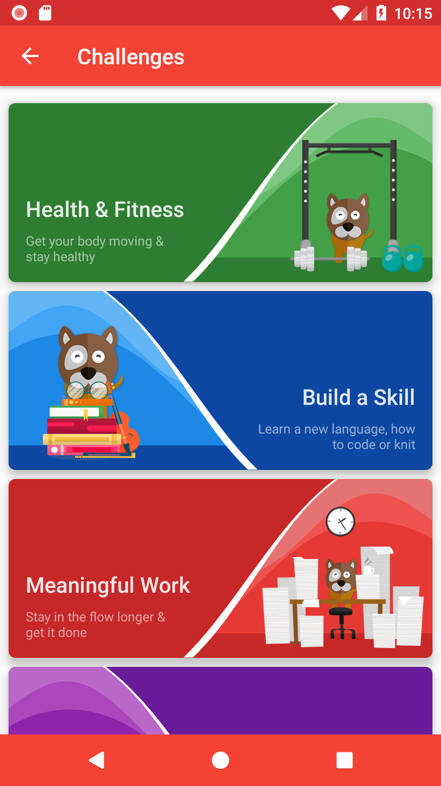
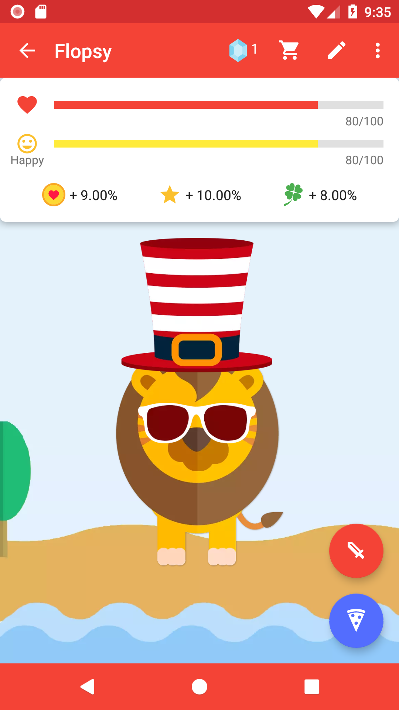

# [myPoli](http://bit.ly/ipoli-android): Personal smart time-management for you

myPoli combines Calendar, ToDo list and Habit tracking app, all in one place to give you the best way to achieve your goals! Find time to exercise, learn new skills, focus deeply on meaningful work, stick to good habits and free you from the burden of scheduling tasks by yourself.

 &nbsp;&nbsp;&nbsp;
 &nbsp;&nbsp;&nbsp;
 &nbsp;&nbsp;&nbsp;

# Join the Community

Have a question about **myPoli**? Found a bug or a feature is missing? Join us at Discord:

# Download

**myPoli** can be download from [Google Play](http://bit.ly/ipoli-android):

# Features

* Calendar + ToDo list for your daily schedule
* Have your own Pet - choose a Pet and take care of it by completing your Tasks
* Pomodoro Timer, Markdown notes & Subtasks
* Sync between Android devices
* Flexible habit scheduling - Workout 3 times per week every Mon, Tue, Fri and Sat
* Sync with Google Calendar/Outlook
* Amazing customization - choose your own theme, icons & colors

# Libraries used

* Conductor
* Kotlin Coroutines
* Firestore
* Firebase
* Dagger2
* MPAndroidChart
* Timber
* Android-Job
* probably some more

# Have a question or just want to get in touch?

Join the community on [Discord](https://discord.gg/7AMKs28) or write us at [hi@mypoli.fun](mailto:hi@mypoli.fun)

# Contributing

Want to learn more about the source code of **myPoli**? Join the community on [Discord](https://discord.gg/7AMKs28) and we will help you get up to speed!  

Want new features or bug fixes? Please **contribute** to the  project either by [_creating a PR_](https://github.com/iPoli/iPoli-android/compare) or [_submitting an issue_](https://github.com/iPoli/iPoli-android/issues/new) on GitHub.  
You can help translate **myPoli** at [OneSky](https://ossiudx.oneskyapp.com/collaboration/project?id=110776).

# License

[GNU GPLv3](https://github.com/iPoli/iPoli-android/blob/master/LICENSE.md)
