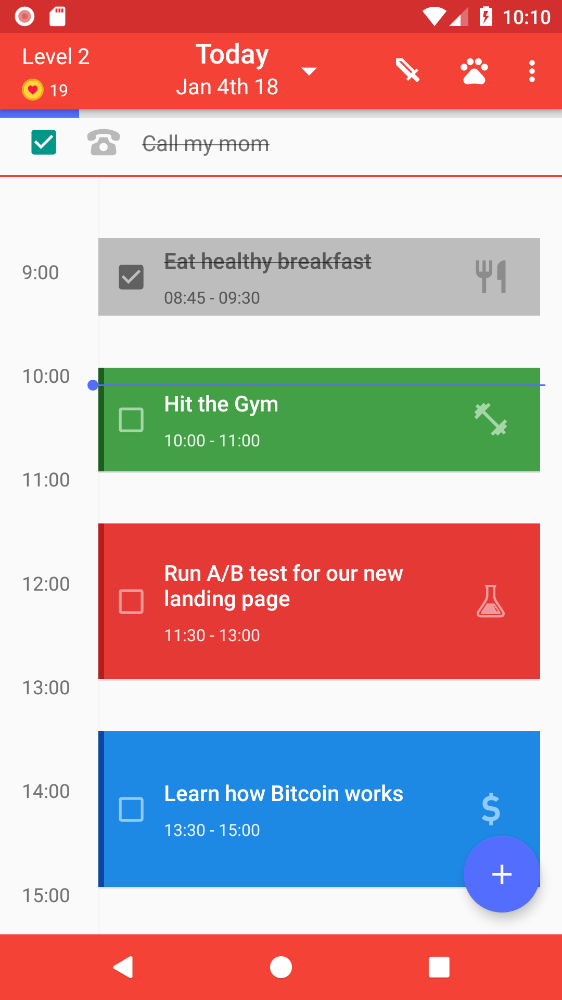
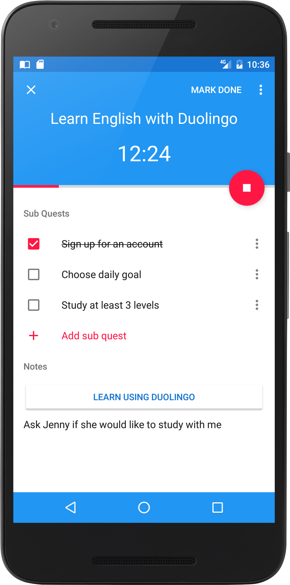
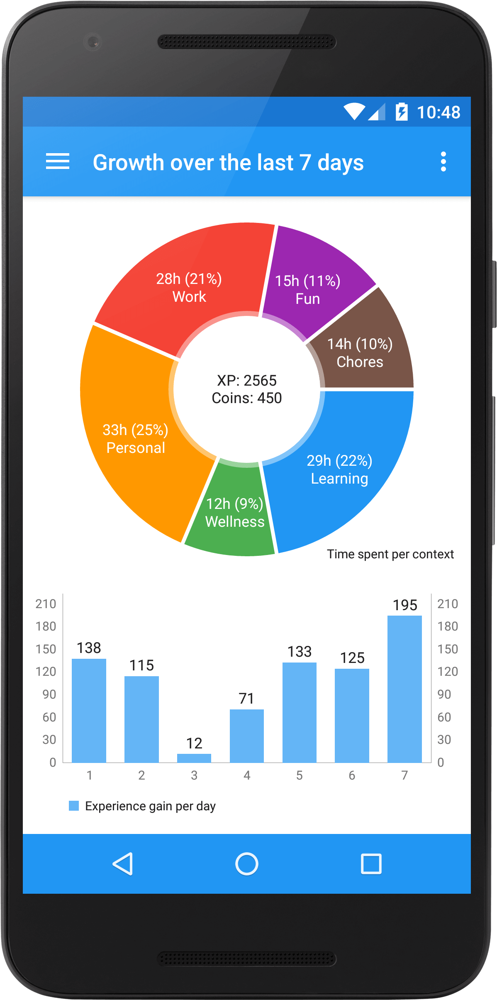

# [iPoli](http://bit.ly/ipoli-android): AI-Powered Calendar & Habit Tracking for your Life!

iPoli is a combination of Calendar, ToDo list and Habit tracking app, all in one place! It's goal is to find time for the things that matter most in your life, make you stick to good habits and free you from the burden of scheduling tasks by yourself.

 &nbsp;&nbsp;&nbsp;
 &nbsp;&nbsp;&nbsp;
 &nbsp;&nbsp;&nbsp;

# Download

**iPoli** can be download on [Google Play](http://bit.ly/ipoli-android):

# Features

* Calendar + ToDo list for your daily schedule
* Smart Add - adding tasks using natural language
* Progress Charts - Which tasks take most of your time? Did you work on more important tasks last week?
* Sync between device & server
* Flexible habit scheduling - Workout 3 times per week every Mon, Tue, Fri and Sat
* Sync with Google Calendar/Outlook (something else?)
* Automatic task scheduling - find the best slot (time) to start/do a task

# Libraries used

* Otto
* Couchbase Lite
* Butterknife
* Dagger2
* MPAndroidChart
* OkHttp
* probably some more

# Have a question or just want to get in touch?

Join the community on [Slack](https://slofile.com/slack/productivityhackers) or write us at [hi@ipoli.io](mailto:hi@ipoli.io)

# Contributing

You love **iPoli**? You want new features or bug fixes?  
Please **contribute** to the  project either by [_creating a PR_](https://github.com/iPoli/iPoli-android/compare) or [_submitting an issue_](https://github.com/iPoli/iPoli-android/issues/new) on GitHub.  
You can help translate **iPoli** at [OneSky](https://ossiudx.oneskyapp.com/collaboration/project?id=110776).

# License

[GNU GPLv3](https://github.com/iPoli/iPoli-android/blob/master/LICENSE.md)
